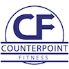

# Counterpoint Fitness | Private Personal Training Studio | Blackrock

## User-centric Frontend Development Milestone Project

This is a simple single page website for a private personal training studio. The website is intended to help the business owner generate new business, inform potential clients of the services provided, provide directions to the studio and social media links.

The goals for the **business owner** are as follows:

- Generate new leads
- Show potential clients how this studio and service provided are different to the vast majority of gyms
- Establish a more professional online presence

The business owner has observed that there are three categories of visitor to the studio's existing website. This website is designed to serve all three visitor types with the use of only one page in an effort to reduce loading times, bounce rate and the effort required for each of the three types of visitor to acheive the goal of their visit.

The three types of **visitor** are as follows:

1. A person who is ready to trial/sign up to the service straight away
2. Someone who is possibly interested in personal training but needs further information before committing to anything
3. A person who is looking for information such as directions and contact details but isn't interested in personal training

Each type of visitor will have a slightly different user experience, and their profile and goals are detailed below.

### Visitor type one

This site visitor likely has the following profile:

- They already understand the value of personal training
- They have already made the decision that personal training is for them
- They might have previous experience of personal training or gyms
- They are highly likely to become a paying client and know there will be a significant financial cost

This visitor/potential client's goals are as follows:

- They would like to quickly get in touch with a view to booking in a consultation as soon as possible
- Their decision is already made and they don't want to be jumping through hoops or filling out long forms - they're ready to go

### Visitor type two

This person is a few steps behind visitor type one in their journey:

- They don't fully understand what personal training is and how it can benefit them - they might also have a negative perception of personal trainers or even the whole fitness industry
- They would like to learn more about what personal training is and how Counterpoint Fitness is different
- They likely have minimal experience of gyms or fitness classes
- They are less likely to become a paying client and might not have any idea of typical personal training costs

Their goals are:

- Enquire via the contact form or phone number to get further information about how it can benefit them personally
- Compare the website of Counterpoint Fitness with its competitors before perhaps getting in touch

### Visitor type three

This person is very different to the first two types:

- They are not interested in becoming a client

Their goal is: 

- To sell a product or service

## User experience

The site aims to give each of the three visitor profiles a smooth and fuss-free experience by using a simple and intuitive design.

Each of the five planes of UX was considered carefully.

### Strategy

### Scope

### Structure

### Skeleton

### Surface

